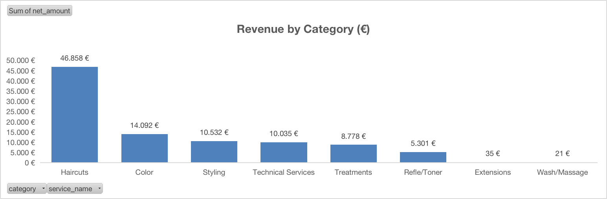
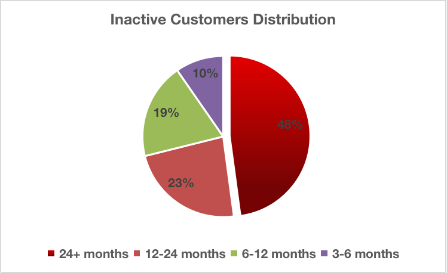
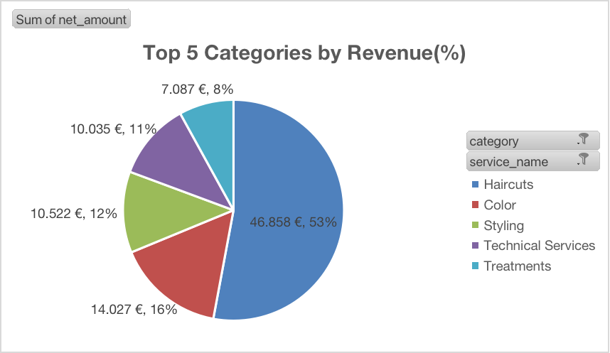

# 💇‍♂️ Hair Salon Data Analysis (2025)

## 📊 Project Overview
This project analyzes real business data from a hair salon using **Excel**.

The analysis focuses on revenue performance, service categories, employee contribution, and customer inactivity, aiming to uncover opportunities for growth and improved customer retention.

---

## 📅 Analysis Period
01/01/2025 – 31/12/2025

---

## 🎯 Business Questions
- Which services generate the most revenue?
- Which employees contribute the most to total revenue?
- What are the top-performing categories?
- How is customer inactivity distributed?
- Where are the biggest opportunities for revenue growth?

---

## 📊 Key Insights
- 💇‍♂️ Haircuts dominate overall revenue
- 📊 Revenue is concentrated in a few key categories
- 👥 Performance varies significantly across employees
- 📉 A large percentage of customers are inactive for long periods
- 💡 Strong opportunity for customer reactivation strategies

---

## 📂 Dataset
The dataset includes:
- Service data
- Categories (Haircuts, Color, Styling, etc.)
- Employee performance
- Revenue data
- Customer inactivity segments

---

## 📈 Analysis Features
- Revenue by category (Pivot tables)
- Revenue by employee
- Top 5 categories analysis
- Customer inactivity segmentation

---

## 🛠 Tools Used
- Excel (Pivot Tables, Charts)
- Data Cleaning & Transformation

---

## 📷 Dashboard Preview

---

## 💡 Business Recommendations
- Target inactive customers with promotions
- Focus on high-value service categories
- Improve retention through loyalty programs
- Track customer return behavior over time

---

## 🚀 Project Structure
hair-salon-data-analysis/
│
├── Data/
│   └── salon_data.xlsx
├── Images/
├── Recommendations/
│   └── business_recommendations.md
├── README.md

---

## 📎 How to Use
1. Open the Excel file
2. Explore pivot tables and charts
3. Analyze insights and recommendations

---

## 🔗 Connect with me
This project is part of my transition into Data Analysis.
